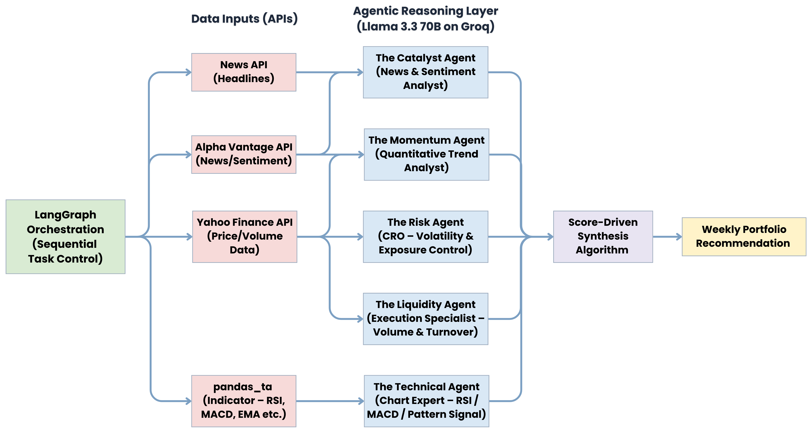
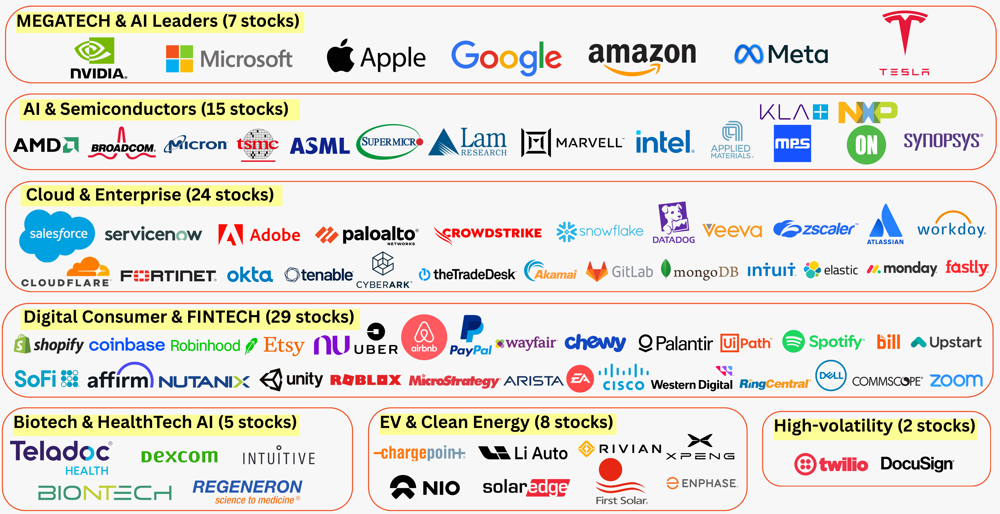
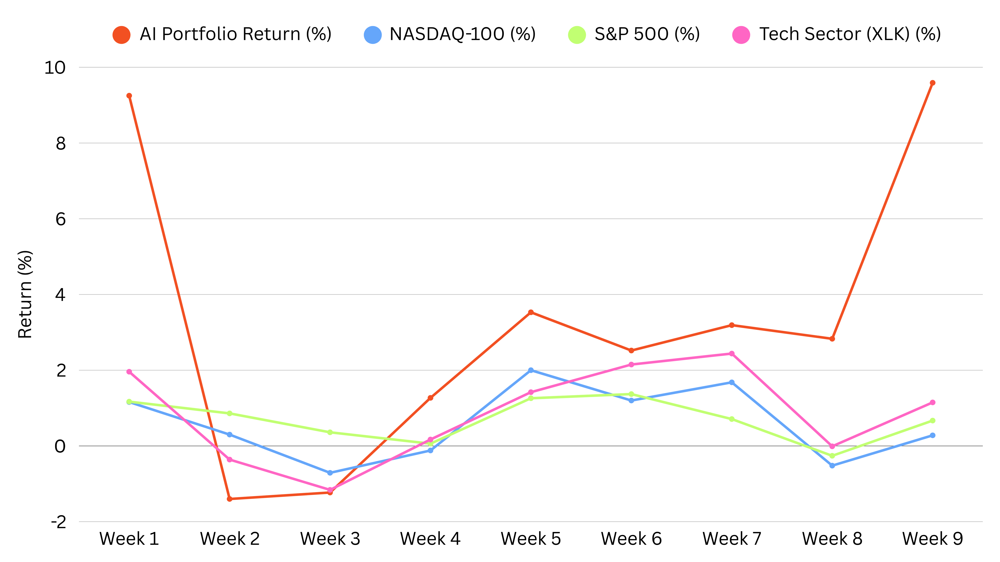
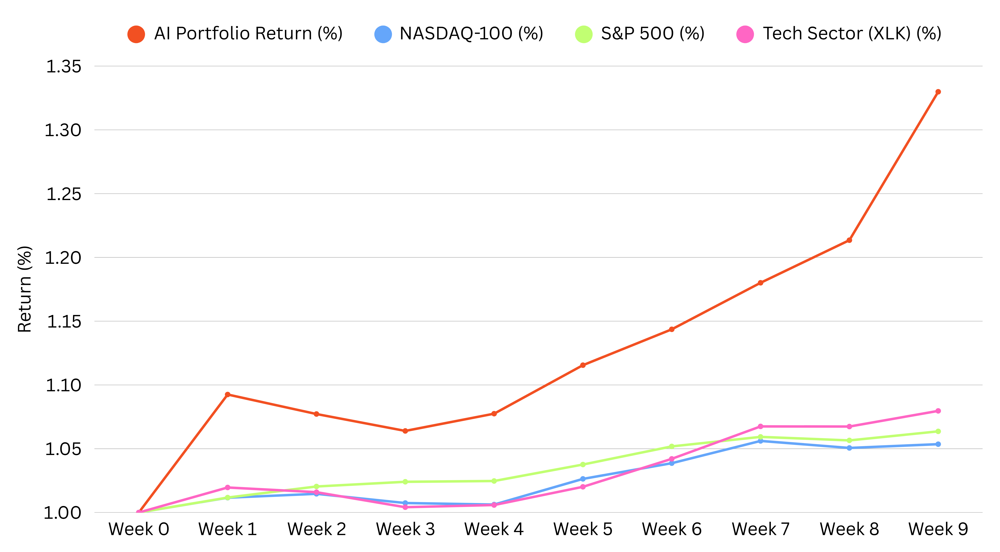

# An Agentic AI Framework for Weekly Stock Portfolio Selection in the U.S. Tech Sector
### Graduate Independent Study — NIDA (2025)  
**Author:** Kunakorn Pruksakorn  
**Advisor:** Asst. Prof. Ekarat Rattagan  
**Affiliation:** Graduate School of Applied Statistics, National Institute of Development Administration (NIDA), Thailand  

---

## Abstract  

Automating sophisticated investment strategies in changing markets is quite hard, especially for short-term horizons when quick data synthesis and adaptive reasoning are essential. A new Agentic AI framework helps with the difficulties of optimizing portfolios in the U.S. technology industry every week. The architecture uses zero-shot reasoning from a core LLM (Llama 3.3 70B) to create five specialized agent roles: Momentum, Catalyst, Technical, Liquidity, and Risk. These agents look at a universe of 90 stocks for a rigid 5-day trading cycle (Monday purchase, Friday sell). Many current AI methods have problems with validation since they only use backtesting. They also have problems with scalability when it comes to sophisticated reasoning protocols like debate, they aren't clear, or they don't create meaningful, allocated portfolios for very short-term cycles. To get over these problems, we suggest an efficient and clear architecture run by LangGraph, where agent insights are combined using a structured, score-driven algorithm that is specifically made for practical weekly use and has been tested in actual market situations. The AI-generated portfolio had a very good average weekly return of +3.28%, which was much better than the NASDAQ-100, S&P 500, and XLK benchmarks. It also had a very high risk-adjusted performance with an Annualized Sharpe Ratio of 6.02 and strong downside control with a Maximum Weekly Drawdown of only -1.40%. These outcomes from a meticulous 9-week live investment experiment, executed through genuine market transactions, furnish robust empirical evidence of the framework's effectiveness.  

---

## System Overview  

The architecture is built upon a modular Agentic AI workflow coordinated by **LangGraph**.  
Each specialized agent conducts zero-shot reasoning using contextual financial data retrieved from multiple APIs.

| Layer | Description |
|-------|--------------|
| **LangGraph Orchestration** | Controls the end-to-end workflow and agent sequencing |
| **Data APIs** | Yahoo Finance, Alpha Vantage, NewsAPI, pandas-ta |
| **Reasoning Engine** | Llama 3.3 70B on Groq (zero-shot reasoning) |
| **Agents** | 5 domain-specialized LLM agents |
| **Output** | Weekly 5-stock portfolio recommendation |

---

## 👥 Agent Design and Roles  

| Agent | Persona | Core Question | Primary Focus |
|:------|:---------|:---------------|:---------------|
| **Momentum Agent** | Quantitative Trend Analyst | “Is this a durable trend or noise?” | 5-day momentum strength & volume confirmation |
| **Catalyst Agent** | News & Sentiment Analyst | “Is this catalyst genuine or priced in?” | Detects mispriced news and sentiment shifts |
| **Technical Agent** | Chart Pattern Expert | “Do multiple indicators converge?” | Confirms high-probability setups (RSI, MACD, EMA) |
| **Liquidity Agent** | Execution Specialist | “Can we enter/exit without slippage?” | Evaluates volume stability & market depth |
| **Risk Agent** | Chief Risk Officer | “What could go wrong?” | Assesses VaR, volatility, and drawdown risk |

Each agent returns JSON-structured scores, confidence, and rationale, which are synthesized through a **weighted scoring algorithm** (0.2 per agent) to yield a single “Weekly Opportunity Score”.

---

## 💾 Data Sources & Integration  

| Agent / Function | Primary Source | Key Data Used | Limitation / Note |
|-------------------|----------------|---------------|-------------------|
| Market Data | `yfinance` | Historical OHLCV (6 months) for momentum & risk |  Free API, rate-limited |
| News & Sentiment | Alpha Vantage / NewsAPI | Latest 5 articles per stock + sentiment score | Free tier 5 req/min |
| Technical Indicators | pandas-ta (local) | RSI, MACD, SMA, Bollinger Bands | Dependent on price data length |
| Reasoning Layer | Groq API | LLM analysis & rationale generation | Low temperature (0.1) for consistency |

---

## 💡 Stock Universe  

The framework analyzes **90 high-liquidity U.S. technology stocks** (≥ 5 M ADV, ≥ $5 B market cap).  
They are organized into 7 sub-sectors (Figure 2):

| Sector | Examples |
|:--------|:---------|
| Megatech & AI Leaders (7) | NVDA, AAPL, MSFT, GOOGL, AMZN, META, TSLA |
| AI & Semiconductors (15) | AMD, AVGO, TSM, ASML, SMCI … |
| Cloud & Enterprise (24) | CRM, ADBE, NOW, PANW, CRWD … |
| Digital Consumer & FinTech (29) | SHOP, COIN, HOOD, PYPL … |
| Biotech & HealthTech (5) | BNTX, TDOC, ISRG … |
| EV & Clean Energy (8) | TSLA, ENPH, FSLR … |
| High Volatility Momentum (2) | TWLO, DOCU |

---

## 🧠 Workflow Orchestration  

- **Sequential Agent Execution:** LangGraph ensures ordered execution (Momentum → Catalyst → Technical → Liquidity → Risk).  
- **Zero-Shot Reasoning:** Each agent uses its own expert-prompt to evaluate data.  
- **Top 5 stocks by final score** → Weekly portfolio.  

---

## 🧪 Experimental Setup  

| Component | Configuration |
|:-----------|:---------------|
| **Model / API** | Llama 3.3 70B via Groq (Zero-shot reasoning) |
| **Orchestration** | LangGraph (LangChain framework) |
| **Language** | Python 3.11 |
| **Libraries** | `yfinance`, `pandas_ta`, `newsapi-python`, `alpha_vantage`, `langchain`, `pydantic`, `httpx`, `numpy` |
| **Environment** | Google Colab Pro (T4 GPU, High-RAM) |
| **Cycle** | Buy Monday 09:30 ET → Sell Friday 16:00 ET |
| **Duration** | 9 Weeks (Aug 4 – Oct 3 2025) |

---

## 📈 Experimental Results  

### 🗓 Weekly Performance Distribution  
*(Table 4 from manuscript)*  

| Week | Date Range | AI Portfolio (%) | NASDAQ-100 | S&P 500 | XLK |
|:----:|:-----------:|:----------------:|:------------:|:--------:|:----:|
| 1 | Aug 4-8 | **+9.25** | 1.16 | 1.17 | 1.96 |
| 2 | Aug 11-15 | –1.40 | 0.30 | 0.86 | –0.36 |
| 3 | Aug 18-22 | –1.23 | –0.71 | 0.36 | –1.16 |
| 4 | Aug 25-29 | 1.27 | –0.12 | 0.06 | 0.17 |
| 5 | Sep 2-5 | 3.53 | 2.00 | 1.26 | 1.42 |
| 6 | Sep 8-12 | 2.52 | 1.20 | 1.37 | 2.15 |
| 7 | Sep 15-19 | 3.19 | 1.68 | 0.71 | 2.44 |
| 8 | Sep 22-26 | 2.83 | –0.52 | –0.26 | –0.01 |
| 9 | Sep 29-Oct 3 | **9.59** | 0.28 | 0.67 | 1.15 |

---

### 📊 Performance Summary (9 Weeks)

| Metric | AI Portfolio | NASDAQ-100 | S&P 500 | XLK |
|:-------|--------------:|------------:|--------:|----:|
| Avg Weekly Return (%) | **3.28** | 0.59 | 0.69 | 0.86 |
| Cumulative Return (%) | **33.0** | 5.36 | 6.36 | 7.97 |
| Std Dev (%) | 3.86 | 0.93 | 0.64 | 1.27 |
| Sharpe Ratio (Ann.) | 6.02 | 4.12 | 7.10 | 5.03 |
| Max Drawdown (%) | –1.40 | –0.71 | –0.26 | –1.16 |

---

### 📊 Agent Score Patterns (Explainability)  

| Week | Momentum | Catalyst | Technical | Liquidity | Risk | Portfolio Return |
|:----:|:---------:|:---------:|:-----------:|:-----------:|:---------:|:----------------:|
| 1 | 8.5 | 8.1 | 8.6 | 8.6 | 7.6 | **+9.25 %** |
| 2 | 6.2 | 5.8 | 6.5 | 8.4 | 6.1 | –1.40 % |
| 3 | 5.9 | 6.1 | 6.0 | 8.3 | 5.8 | –1.23 % |
| 4 | 6.8 | 6.5 | 7.0 | 8.2 | 6.9 | +1.27 % |
| 5 | 7.4 | 7.0 | 7.6 | 8.4 | 7.2 | +3.53 % |
| 6 | 7.2 | 6.8 | 7.4 | 8.3 | 7.0 | +2.52 % |
| 7 | 7.6 | 7.3 | 7.8 | 8.5 | 7.4 | +3.19 % |
| 8 | 7.5 | 7.1 | 7.7 | 8.4 | 7.3 | +2.83 % |
| 9 | 8.5 | 8.4 | 8.5 | 8.3 | 8.0 | **+9.59 %** |

> 📈 High agent scores (> 8) correlate with strong portfolio performance, confirming explainable alignment between multi-agent reasoning and returns.

---

## 🔍 Explainability and Transparency  

- Each agent produces JSON output with numerical scores and natural-language rationales.  
- Decisions are traceable to specific inputs (news, technical levels, or risk metrics).  
- Framework supports auditable analysis for accountability and debugging.  

Example (NVDA Week 1):  
> *Momentum (9.2): 14-day ROC +15.2 %, RSI 68 indicates sustainable trend.*  
> *Catalyst (8.8): $500 M Microsoft AI partnership boosted sentiment (+0.85).*  
> *Liquidity (9.0): 52 M ADV with low slippage < 2 bps.*  
> *Risk (7.8): Volatility 3.8 %, VaR –5.8 % acceptable.*  

---

## 🧭 Key Findings  

- ✅ **Consistent Outperformance:** AI portfolio beat benchmarks in 7 of 9 weeks.  
- ✅ **Robust Risk Control:** Max weekly drawdown –1.4 % only.  
- ✅ **Explainable Reasoning:** Agent-level scores traceable to data.  
- ✅ **Efficiency:** ~45 min runtime per 90 stocks (Colab Pro).  
- ✅ **Empirical Validation:** Live experiment vs backtesting.  

---

## 📜 Citation  

> **Pruksakorn, K. & Rattagan, E.** (2025).  
> *An Agentic AI Framework for Weekly Stock Portfolio Selection in the U.S. Tech Sector.*  
> Graduate School of Applied Statistics, NIDA, Thailand.  

---

## 🧭 Future Work  

- Expand validation to multi-sector and global indices  
- Integrate broker APIs for real execution  
- Add adaptive learning / self-reflection loops  
- Explore real-time reinforcement scoring  

---

> *Developed as part of the M.Sc. Independent Study in Data Analytics and Data Science (DADS5), NIDA.*  
> *Demonstrating a transparent, score-driven, agentic AI approach for short-term investment strategy.*
