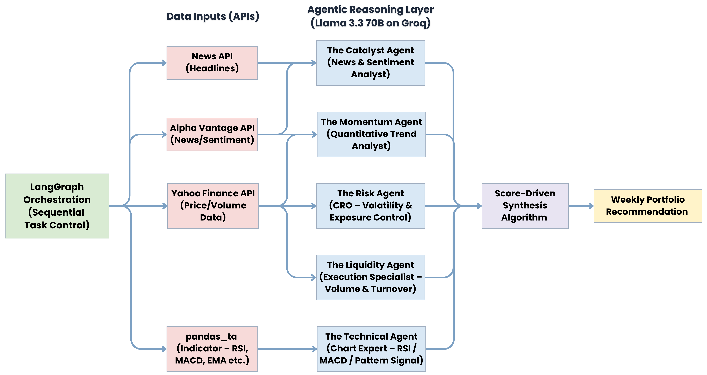
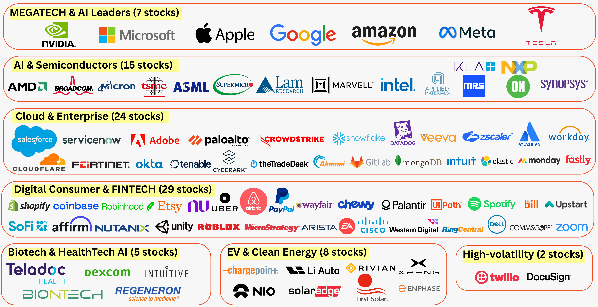
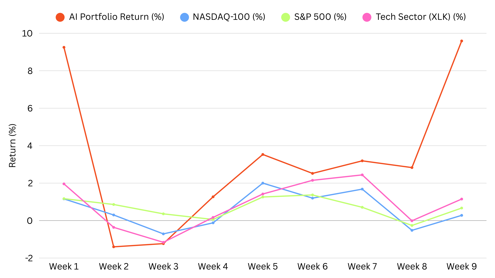
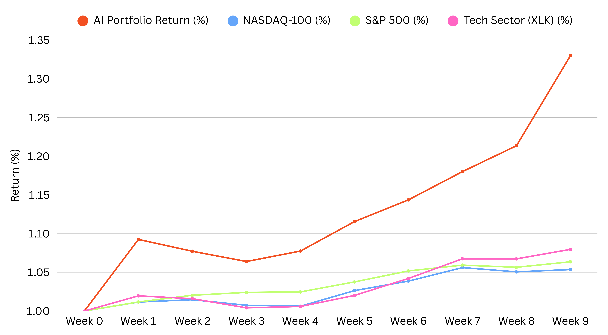

# An Agentic AI Framework for Weekly Stock Portfolio Selection in the U.S. Tech Sector

### Graduate Independent Study — NIDA (2025)
**Author:** Kunakorn Pruksakorn  
**Advisor:** Asst. Prof. Ekarat Rattagan  
**Affiliation:** Graduate School of Applied Statistics, National Institute of Development Administration (NIDA), Thailand

---

## Abstract

Most AI stock selection research stops at backtesting. This project took a more direct approach: build a structured multi-agent system, run it as a live weekly investment experiment for 9 consecutive weeks, and see how it actually performs.

The framework uses five specialized agents — Momentum, Catalyst, Technical, Liquidity, and Risk — each scoring a different dimension of the same 90 U.S. tech stocks. All five use zero-shot reasoning via Llama 3.3 70B on Groq, return structured JSON, and feed into a weighted scoring pipeline that produces a 5-stock weekly portfolio with allocation recommendations. LangGraph manages the workflow sequencing. Positions are opened on Monday and closed on Friday.

Over the 9-week live experiment (Aug 4 – Oct 3, 2025), the portfolio averaged +3.28% per week, reached +32.99% cumulative return, and recorded a maximum single-week drawdown of –1.40%. It outperformed NASDAQ-100, S&P 500, and XLK on cumulative return over the same period. The annualized Sharpe Ratio was 6.02.

This repository includes the portfolio outputs, agent score logs, performance tables, and supporting materials.

---

## System Overview

The architecture is built around a modular Agentic AI workflow coordinated by **LangGraph**. Each agent performs zero-shot reasoning using contextual financial data retrieved from multiple APIs.

| Layer | Description |
|-------|-------------|
| **LangGraph Orchestration** | Controls end-to-end workflow and agent sequencing |
| **Data APIs** | Yahoo Finance, Alpha Vantage, NewsAPI, pandas-ta |
| **Reasoning Engine** | Llama 3.3 70B on Groq (zero-shot, temperature 0.1) |
| **Agents** | 5 domain-specialized LLM agents |
| **Output** | Weekly 5-stock portfolio with % allocation |

---

## Agent Design and Roles

| Agent | Persona | Core Question | Primary Focus |
|:------|:--------|:-------------|:-------------|
| **Momentum** | Quantitative Trend Analyst | "Is this a real trend or noise?" | 5-day momentum and volume confirmation |
| **Catalyst** | News & Sentiment Analyst | "Is this catalyst genuine or already priced in?" | News mispricing and sentiment shifts |
| **Technical** | Chart Pattern Expert | "Do multiple indicators point the same way?" | RSI, MACD, EMA, Bollinger Bands convergence |
| **Liquidity** | Execution Specialist | "Can this position actually be traded?" | Volume consistency, tradability, and execution practicality |
| **Risk** | Risk Control Analyst | "What breaks this trade?" | 5-day VaR, volatility, downside profile |

Each agent returns structured JSON with a numerical score (0–10), confidence, and a plain-language rationale. Outputs are combined via a weighted scoring algorithm (0.2 per agent) to produce a single **Weekly Opportunity Score** per stock.

---

## Data Sources & Integration

| Agent / Function | Primary Source | Key Data Used | Notes |
|:----------------|:---------------|:-------------|:------|
| Market Data | `yfinance` | Historical OHLCV (6 months), fundamentals | Free, unofficial API — rate-limited |
| News & Sentiment | Alpha Vantage / NewsAPI | Latest articles, sentiment-related inputs | Free tier: 5 req/min |
| Technical Indicators | `pandas-ta` (local) | RSI, MACD, SMA, Bollinger Bands | Calculated from yfinance price data |
| Reasoning Layer | Groq API | LLM analysis and JSON output | Low temperature (0.1) for consistency |

---

## Stock Universe

The framework analyzes **90 high-liquidity U.S. technology stocks** (≥ 5M ADV, ≥ $5B market cap), grouped into seven sub-sectors.

| Sector | Examples |
|:-------|:---------|
| Megatech & AI Leaders (7) | NVDA, AAPL, MSFT, GOOGL, AMZN, META, TSLA |
| AI & Semiconductors (15) | AMD, AVGO, TSM, ASML, SMCI |
| Cloud & Enterprise (24) | CRM, ADBE, NOW, PANW, CRWD |
| Digital Consumer & FinTech (29) | SHOP, COIN, HOOD, PYPL |
| Biotech & HealthTech AI (5) | BNTX, TDOC, ISRG |
| EV & Clean Energy (8) | ENPH, FSLR, NIO |
| High Volatility Momentum (2) | TWLO, DOCU |

---

## Workflow

Sequential execution via LangGraph: **Momentum → Catalyst → Technical → Liquidity → Risk**

Each agent runs independently against its assigned data, produces a score, and passes structured output forward. No inter-agent debate is used in the current design. The final scoring step aggregates all five outputs into a ranked list, and the top 5 stocks form the weekly portfolio.

Full runtime for 90 stocks: ~45 minutes on Google Colab Pro. :contentReference[oaicite:3]{index=3}

---

## Experimental Setup

| Component | Configuration |
|:----------|:-------------|
| **Model** | Llama 3.3 70B via Groq (zero-shot) |
| **Orchestration** | LangGraph |
| **Language** | Python 3.11 |
| **Libraries** | `yfinance`, `pandas_ta`, `newsapi-python`, `alpha_vantage`, `langchain`, `pydantic`, `httpx`, `numpy` |
| **Environment** | Google Colab Pro (T4 GPU, high-RAM) |
| **Trading Cycle** | Buy Monday open (09:30 ET) → Sell Friday close (16:00 ET) |
| **Validation Period** | 9 weeks: Aug 4 – Oct 3, 2025 |
| **Capital per week** | $200 fixed capital, reset weekly (no cross-week compounding) |

---

## Results

### Weekly Performance vs. Benchmarks

| Week | Date Range | AI Portfolio (%) | NASDAQ-100 | S&P 500 | XLK |
|:----:|:----------:|:---------------:|:----------:|:-------:|:---:|
| 1 | Aug 4–8 | **+9.25** | 1.16 | 1.17 | 1.96 |
| 2 | Aug 11–15 | –1.40 | 0.30 | 0.86 | –0.36 |
| 3 | Aug 18–22 | –1.23 | –0.71 | 0.36 | –1.16 |
| 4 | Aug 25–29 | 1.27 | –0.12 | 0.06 | 0.17 |
| 5 | Sep 2–5 | 3.53 | 2.00 | 1.26 | 1.42 |
| 6 | Sep 8–12 | 2.52 | 1.20 | 1.37 | 2.15 |
| 7 | Sep 15–19 | 3.19 | 1.68 | 0.71 | 2.44 |
| 8 | Sep 22–26 | 2.83 | –0.52 | –0.26 | –0.01 |
| 9 | Sep 29–Oct 3 | **+9.59** | 0.28 | 0.67 | 1.15 |

---

### Performance Summary

| Metric | AI Portfolio | NASDAQ-100 | S&P 500 | XLK |
|:-------|------------:|----------:|-------:|----:|
| Avg Weekly Return (%) | **3.28** | 0.59 | 0.69 | 0.86 |
| Cumulative Return (%) | **32.99** | 5.36 | 6.36 | 7.97 |
| Weekly Std Dev (%) | 3.86 | 0.93 | 0.64 | 1.27 |
| Sharpe Ratio (Annualized) | 6.02 | 4.12 | 7.10 | 5.03 |
| Max Drawdown (weekly %) | –1.40 | –0.71 | –0.26 | –1.16 |

The AI portfolio produced the highest cumulative return over the test window, though the S&P 500 showed a higher annualized Sharpe Ratio because it achieved lower weekly volatility over the same period. :contentReference[oaicite:4]{index=4}

---

## Agent Score Patterns

The table below shows average agent scores by week alongside portfolio return. It is included as an explainability check rather than evidence of a causal relationship.

| Week | Momentum | Catalyst | Technical | Liquidity | Risk | Portfolio Return |
|:----:|:--------:|:--------:|:---------:|:---------:|:----:|:---------------:|
| 1 | 8.5 | 8.1 | 8.6 | 8.6 | 7.6 | **+9.25%** |
| 2 | 6.2 | 5.8 | 6.5 | 8.4 | 6.1 | –1.40% |
| 3 | 5.9 | 6.1 | 6.0 | 8.3 | 5.8 | –1.23% |
| 4 | 6.8 | 6.5 | 7.0 | 8.2 | 6.9 | +1.27% |
| 5 | 7.4 | 7.0 | 7.6 | 8.4 | 7.2 | +3.53% |
| 6 | 7.2 | 6.8 | 7.4 | 8.3 | 7.0 | +2.52% |
| 7 | 7.6 | 7.3 | 7.8 | 8.5 | 7.4 | +3.19% |
| 8 | 7.5 | 7.1 | 7.7 | 8.4 | 7.3 | +2.83% |
| 9 | 8.5 | 8.4 | 8.5 | 8.3 | 8.0 | **+9.59%** |

Weeks 1 and 9 had the strongest overall agent scores and also produced the highest returns. Liquidity remained consistently high across all weeks, which makes sense given that the stock universe was pre-filtered for liquidity. 

---

## Explainability

Every portfolio recommendation is traceable. Each agent outputs a score, confidence level, and a short rationale tied to the specific data it processed. The portfolio construction step logs which agents had the strongest influence on each stock’s final ranking.

**Example — NVDA, Week 1:**
- **Momentum (9.2):** 14-day ROC at +15.2%, RSI 68 — strong trend with no divergence signal
- **Catalyst (8.8):** Positive AI-related news flow; sentiment score above sector average
- **Liquidity (9.0):** 52M ADV with strong tradability
- **Risk (7.8):** Weekly VaR at –5.8%; volatility elevated but still within threshold

---

## Limitations

- Only one LLM was tested; no comparison was made against GPT-4, Claude, or other foundation models
- The framework relies entirely on zero-shot prompting, with no domain-specific fine-tuning
- Agent weights remained fixed at 20% each throughout the experiment
- The validation window was short at 9 weeks
- The study covered only U.S. technology stocks

These are the main areas for follow-up work. :contentReference[oaicite:6]{index=6}

---

## Future Work

- Test multiple LLMs on the same weekly evaluation windows
- Add adaptive agent weighting or feedback mechanisms
- Extend validation to longer periods and broader sectors
- Integrate broker APIs for more automated execution
- Explore intraday or longer-horizon variants

---

## Citation

> **Pruksakorn, K. & Rattagan, E.** (2025).  
> *An Agentic AI Framework for Weekly Stock Portfolio Selection in the U.S. Tech Sector.*  
> Graduate School of Applied Statistics, NIDA, Thailand.

---

## Project Podcast

A bilingual podcast discussion is available for readers who prefer an audio walkthrough of the project:

| Language | Link |
|:---------|:-----|
| English | [Watch on YouTube](https://youtu.be/aKs1FSbS9bI) |
| ภาษาไทย | [ฟังพอดแคสต์ภาษาไทย](https://youtu.be/8hXI0siDsng) |

---

*Developed as part of the M.Sc. Independent Study in Data Analytics and Data Science at NIDA.*
